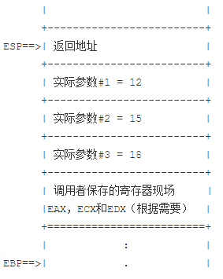
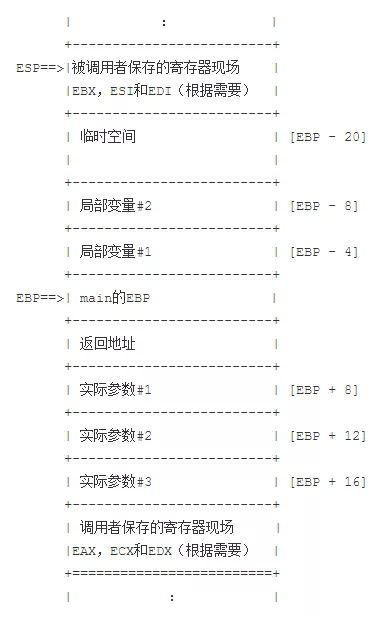
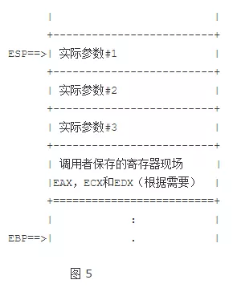

# 操作系统

## 编译
UNIX上编译一个c语言程序使用如下命令生成可执行文件`gcc -o hello hello.c`

编译系统分为预处理器(preprocessor)、编译器(compiler)、汇编器(assembler)和链接器(linker)四个部分组成。

1. 预处理阶段：预处理器（cpp）将根据以字符 '#' 开始的命令修改原始的C语言程序，得到另一个C语言程序，通常以`.i`作为文件后缀，例如`hello.i`；
2. 编译阶段：编译器（ccl）将文本文件`hello.i`翻译成文本文件`hello.s`，包含一个汇编语言程序。
3. 汇编阶段：汇编器（as）将`hello.s`翻译成机器语言指令，并把指令打包成一种可重定位目标程序（relocatable object program）的格式，并将结果保存在目标文件`hello.o` 中。
4. 链接阶段：链接器（ld）负责将一些已经存在于标准库中的目标文件合并到同一个文件中去(假设printf 函数存在于printf.o单独预编译好的目标文件中)，生成一个可执行目标文件`hello`。

## 了解编译系统如何工作带来的益处
1. 优化程序性能；
2. 理解链接时出现的错误；
3. 避免安全漏洞；

## 操作系统管理硬件
操作系统两个基本功能：
1. 防止硬件被失控的应用程序滥用；
2. 向应用程序提供简单一致的抽象机制来控制复杂而又通常不同的硬件外设；

操作系统通过提供（进程、虚拟存储器、文件）几个基本抽象概念来实现这两个功能。


# C 语言栈调用方式

IA32和x86-64的寄存器的名称及数量不一致，IA32有8个寄存器，x86-64有16个寄存器，IA32的寄存器`%ESP`用来做栈指针寄存器，指向栈顶，`%EBP`作为基准地址，指向栈帧开始；x86-64用`%rsp`做栈指针寄存器，指向栈顶，`%rbp`几乎不作为栈帧指针使用。栈的增长方向是向内存地址更小的方向增长，及新push的元素应该是`%rsp-8`此类的。

**X86-64** 的寄存器功能分类：
1. %rax 作为函数返回值使用；
2. %rsp 栈指针寄存器，指向栈顶；
3. %rdi，%rsi，%rdx，%rcx，%r8，%r9 用作函数参数，依次对应第1参数，第2参数，...；
4. %rbx，%rbp，%r12，%r13，%14，%15 用作数据存储，遵循被调用者使用规则；
5. %r10，%r11 用作数据存储，遵循调用者使用规则；
6. 按照惯例`%rbx`、`%rbp`和`%r12-%r15`被划分为调用者保存寄存器（Callee saved），即过程P调用了过程Q，则Q应该保证这些寄存器过程前后的值不会发生改变；其余的寄存器除了`%rsp`（就`%r10`、`%r11`两个寄存器）为被调用者保存寄存器（Caller saved），即过程P在调用其他程序前应该保存这些寄存器的值在内存中，以免其他过程更改了寄存器的值导致出现bug。

**IA32** 的寄存器功能分类
1. %esp 作为栈指针寄存器，指向栈顶；
2. %ebp 作为帧指针寄存器，可以理解为基准指针，传递到调用函数（caller）的参数以及被调用函数本身申请的局部变量都可以用帧指针寄存器加减偏移量找到；
3. %eax，%ecx,%edx 被划分为调用者保存寄存器；
4. %ebx，%esi,%edi 被划分为被调用者保存寄存器；

从下面`IA32`和`x86-64`的寄存器对比上可以看到，x86-64的寄存器是在IA32的基础上扩充到64位，前缀从`e`换成了`r`，并且增加了8个寄存器`%r8-%r15`。


IA32寄存器的名称及注释


x86-64寄存器的名称及注释

## X86-64 与 IA32 在寄存器上的一些差别
1. x86-64 寄存器的大小是64位8字节； IA32是32位4字节；
2. x86-64 寄存器数量有16个； IA32寄存器数量有8个；
3. x86-64 有6个寄存器可以用来函数传参，多余的参数（从第7个参数开始）通过栈进行传参； IA32寄存器数量少，全部通过栈进行传参（参数是倒序进展，因此第一个参数是%ebp+4，第二个参数是%ebp+8，%ebp存储的是上一个%ebp的地址）；
4. IA32有栈帧指针 %ebp，在x86-64中，扩充而来的%rbp基本不作为栈帧指针使用，而是另做他途。在IA32时代，当前栈帧总是从保存%ebp开始，空间由运行时决定，通过不断push和pop改变当前栈帧空间；x86-64开始，GCC有了新的选择，优化编译选项-O1，可以让GCC不再使用栈帧指针，下面引用 gcc manual 一段话 ：
> -O also turns on -fomit-frame-pointer on machines where doing so does not interfere with debugging.
这样一来，所有空间在函数开始处就预分配好，不需要栈帧指针；通过%rsp的偏移就可以访问所有的局部变量。

5. 从函数callee P中传递参数给函数caller Q的参数，属于函数P的栈帧。
6. x86-64 用 %rax 保存大小小于等于8字节的返回值，如果超过大小，则指向保存返回值的地址； IA32使用 %eax 保存大小小于等于4个字节的返回值，如果大于4字节小于等于8字节，则%edx也会被用来保存返回值，如果返回值占用的空间还要大，那么调用者会向被调用者传递一个额外参数，这个额外参数指向将要保存返回值的地址。

### 为什么 x86-64 不需要栈指针了
1. 有了6个参数寄存器，如果所有的局部变量都可以保存寄存器中，则栈的唯一作用就是保存返回值地址；
2. x86-64过程的栈帧通常有固定的大小，在过程开始时便通过减小`%rsp`栈指针进行设置，因此`%rsp`在程序执行中有固定的位置，不会前后移动，不需要栈帧来找到局部变量和函数参数了。

**x86-64可能用到栈帧的原因**
1. 局部变量过多，寄存器放不下；
2. 某些局部变量是数组或者结构体；
3. 函数用取地址操作符（&）计算一个局部变量的地址（寄存器没有地址），需要把那个局部变量放到内存中去；
4. 函数必须将栈上的某些参数传递到另一个函数；
5. 在修改一个callee saved 寄存器前，函数需要保存这个callee saved寄存器的状态；

## 函数调用时栈的变换
### 函数调用时调用者的操作
1. 首先，调用者P将自己使用了的caller saved寄存器的值压栈保存，防止被接下来调用了的函数Q修改。（可选，如果没有使用这些寄存器，则不需要操作）
2. P把传递给Q的参数加入参数寄存器，多出来的入栈保存；
3. 使用 `call Q` 调用子函数；
4. call 命令执行的时候，将返回地址（地址A）压入栈，并将程序计数器PC设置为过程Q的起始地址。对应的ret会pop 地址A，然后将 PC 改回地址A。

如图所示，是ia32的栈变换的效果



### 被调用者在函数调用后的动作
1. 建立自己的栈帧，因为当前%ebp正指向调用函数P的栈帧开始，所以将栈帧指针%ebp进栈保存，并修改%ebp的值为%esp，使得函数的参数可以通过%ebp和偏移量寻找到，而栈顶指针 %rsp可以用来分配其他空间；`push %ebp; mov %ebp, %esp;`
2. 为函数自己的局部变量分配空间，通过减小%esp的值，分配新的空间；
3. 如果函数Q用到了 Callee saved 寄存器，则需要先将该寄存器入栈保存，并在函数结束前恢复寄存器的值；

如图所示，是ia32的栈变换的效果




### 被调用者返回前的动作
1. 将返回值保存在返回值寄存器`%eax %rax`中；
2. 恢复调用者保存寄存器的值；
3. 释放局部变量，之后恢复栈帧`mov esp, ebp; pop ebp;`
4. 执行 ret 命令，将PC程序计数器改回地址A，继续执行过程P接下来的内容；

如图所示，是ia32的栈变换的效果



### 调用者在返回后的操作
1. 将传递给过程Q的参数出栈；
2. 恢复被调用者保存寄存器的值，出栈；
3. 继续执行；

## 性能提高技术
1. 高级设计。为遇到的问题选择适当的算法和数据结构，避免使用那些会渐进地产生糟糕性能的算法或编码技术。
2. 基本编码原则。
    > - 消除连续的函数调用。
    > - 消除不必要的内存引用。

3. 低级优化
    > - 展开循环，降低开销，使进一步的优化成为可能。
    > - 通过使用例如多个累计变量和重新结合等技术，找到方法提高指令级并行。
    > - 用功能性的风格重写条件操作，使得编译采用条件数据传送。

# 进程与线程的相关问题
##### 1. 进程与线程的区别
1. **资源：** 进程拥有资源，进程是资源分配的基本单位，线程不具有资源，但线程可以访问所述进程的资源；
2. **调度：** 线程是独立调度的基本单位，在同一进程中，线程的切换不会引起进程的切换，从一个进程切换到另一个进程中的线程时，会引起进程切换；
3. **系统开销：** 创建、销毁进程的系统开销比创建和销毁线程的开销要大；进程切换时，系统开销也比线程切换时开销要大；
4. **通信方面：** 线程间通信可以直接通过访问进程中同一个数据块（通过互斥量、读写锁、条件变量、自旋锁、屏障等方式进行线程同步），进程要依赖于更多的进程间通信措施，复杂的得多（管道、FIFO、消息队列、信号量、共享存储等方式） 

##### 2. 协程是什么
**协程是一种用户态的轻量级线程**，协程的调度完全由用户控制。协程拥有自己的寄存器上下文和栈。协程调度切换时，将寄存器上下文和栈保存到其他地方，在切回来的时候，恢复先前保存的寄存器上下文和栈，直接操作栈则基本没有内核切换的开销，可以不加锁的访问全局变量，所以上下文的切换非常快。

##### 3. 协程与多线程的比较
1. 一个线程可以多个协程，一个进程也可以单独拥有多个协程，这样python中则能使用多核CPU。
2. 线程进程都是同步机制，而协程则是异步
3. 协程能保留上一次调用时的状态，每次过程重入时，就相当于进入上一次调用的状态
4. 协程不是被操作系统内核所管理，而完全是由程序所控制（也就是在用户态执行）。这样带来的好处就是性能得到了很大的提升，不会像线程那样需要上下文切换来消耗资源，因此协程的开销远远小于线程的开销。

##### 4. 协程的优点
地方


# 进程调度算法
## 对批处理系统
1. **先来先服务（FCFS）** 非抢占式的调度算法，按照请求顺序进行调度。有利于长作业，不利于短作业。
2. **短作业优先（SJF）** 非抢占式调度算法，按照估计运行时间最短的顺序进行调度。导致长作业一直无法得到调度。
3. **最短剩余时间优先（SRTN）** 按照最短剩余时间进行调度。新作业到达，将整个运行时间与当前进程的剩余时间比较，如果新进程的更少，就挂起当前进程，运行新进程。否则新进程等待。

## 交互式系统
1. **时间片轮转法**
2. **优先级调度**
3. **多级反馈队列**

# APUE 进程进程间通信相关问题
## 管道（匿名）
管道是半双工的，数据只能向一个方向流动；需要双方通信时，需要建立起两个管道 只能用于父子进程或者兄弟进程之间（具有亲缘关系的进程）单独构成一种独立的文件系统：管道对于管道两端的进程而言，就是一个文件，但它不是普通的文件，它不属于某种文件系统，而是自立门户，单独构成一种文件系统，并且只存在与内存中。

fd[0] 为读而打开， fd[1] 为写而打开。

## FIFO（有名称）
　FIFO不同于管道之处在于它提供一个路径名与之关联，以FIFO的文件形式存在于文件系统中。这样，即使与FIFO的创建进程不存在亲缘关系的进程，只要可以访问该路径，就能够彼此通过FIFO相互通信。FIFO严格遵循先进先出（first in first out），对管道及FIFO的读总是从开始处返回数据，对它们的写则把数据添加到末尾。它们不支持诸如lseek()等文件定位操作。


## XSI IPC

消息队列、信号量、共享存储区相似的特征如下：具有标识符和键，标识符是IPC对象的内部名，每个IPC对象都与一个键相关联，创建IPC结构需要指定一个键，键的数据类型为key_t。每个IPC都设置了权限结构。

　　优点及缺点：IPC结构是在系统范围内起作用，没有访问计数。在文件系统中没有名字，不使用文件描述符，不能对它们使用多路转接I/O函数。优点：可靠、流是受控的，面向记录、可以用非先进先出方式处理。

###  消息队列

　　消息队列（Messge Queue）：消息队列是消息的链接表，包括Posix消息队列SystemV消息队列。它克服了前两种通信方式中信息量有限的缺点，具有写权限的进程可以按照一定的规则向消息队列中添加新消息；对消息队列有读权限的进程则可以从消息队列中读取消息。

### 信号量

　　信号量（Semaphore）：主要作为进程之间以及同一进程的不同线程之间的同步和互斥手段。

### 共享存储
　　共享内存（Shared memory）：可以说这是最有用的进程间通信方式。它使得多个进程可以访问同一块内存空间，不同进程可以及时看到对方进程中对共享内存中数据的更新。这种通信方式需要依靠某种同步机制，如互斥锁和信号量等。

### UNIX 域套接字
UNIX域套接字用于在同一台计算机上运行的进程之间的通信。虽然因特网域套接字可用于同一目的,但UNIX域套接字的效率更高。UNIX域套接字仅仅复制数据,它们并不执行协议处理,不需要添加或删除网络报头,无需计算校验和,不要产生顺序号,无需发送确认报文。

UNIX域套接字提供流和数据报两种接口。UNIX域数据报服务是可靠的,既不会丢失报文也不会传递出错。UNIX域套接字就像是套接字和管道的混合。

# APUE 线程同步相关问题
## 互斥量
## 读写锁
## 条件变量
## 自旋锁
## 屏障

# 进程同步的三个经典问题

## 进程同步
进程是并发执行的，不同的进程之间存在不同的相互制约关系。我们把异步环境下的一组并发进程**因直接制约而互相发送消息、进行互相合作、互相等待，使得各进程按一定的速度执行的过程**称为进程间的同步。

## 1. 生产者消费者问题
### 问题描述

生产者消费者问题（英语：Producer-consumer problem），也称有限缓冲问题（英语：Bounded-buffer problem），是一个多进程同步问题的经典案例。
1. 该问题描述了共享固定大小缓冲区的两个进程——即所谓的“生产者”和“消费者”——在实际运行时会发生的问题。
2. 生产者的主要作用是生成一定量的数据放到缓冲区中，然后重复此过程。
3. 与此同时，消费者也在缓冲区消耗这些数据。
4. 该问题的关键就是要保证生产者不会在缓冲区满时加入数据，消费者也不会在缓冲区中空时消耗数据。

要解决该问题，就必须让生产者在缓冲区满时休眠（要么干脆就放弃数据），等到下次消费者消耗缓冲区中的数据的时候，生产者才能被唤醒，开始往缓冲区添加数据。同样，也可以让消费者在缓冲区空时进入休眠，等到生产者往缓冲区添加数据之后，再唤醒消费者。

通常采用进程间通信的方法解决该问题。如果解决方法不够完善，则容易出现死锁的情况。出现死锁时，两个线程都会陷入休眠，等待对方唤醒自己。该问题也能被推广到多个生产者和消费者的情形。

### 使用信号量的解决方法

为了同步生产者和消费者的行为，需要记录缓冲区中物品的数量。数量可以使用信号量来进行统计，这里需要使用两个信号量：empty 记录空缓冲区的数量，full 记录满缓冲区的数量。其中，empty 信号量是在生产者进程中使用，当 empty 不为 0 时，生产者才可以放入物品；full 信号量是在消费者进程中使用，当 full 信号量不为 0 时，消费者才可以取走物品。

注意，不能先对缓冲区进行加锁，再测试信号量。也就是说，不能先执行 down(mutex) 再执行 down(empty)。如果这么做了，那么可能会出现这种情况：生产者对缓冲区加锁后，执行 down(empty) 操作，发现 empty = 0，此时生产者睡眠。消费者不能进入临界区，因为生产者对缓冲区加锁了，消费者就无法执行 up(empty) 操作，empty 永远都为 0，导致生产者永远等待下，不会释放锁，消费者因此也会永远等待下去。

```c
#define N 100
typedef int semaphore;
semaphore mutex = 1;
semaphore empty = N;
semaphore full = 0;

void producer() {
    while(TRUE) {
        int item = produce_item();
        down(&empty);
        down(&mutex);
        insert_item(item);
        up(&mutex);
        up(&full);
    }
}

void consumer() {
    while(TRUE) {
        down(&full);
        down(&mutex);
        int item = remove_item();
        consume_item(item);
        up(&mutex);
        up(&empty);
    }
}
```

## 2. 读者写者问题
允许多个进程同时对数据进行读操作，但是不允许读和写以及写和写操作同时发生。

一个整型变量 count 记录在对数据进行读操作的进程数量，一个互斥量 count_mutex 用于对 count 加锁，一个互斥量 data_mutex 用于对读写的数据加锁。

```c
typedef int semaphore;
semaphore count_mutex = 1;
semaphore data_mutex = 1;
int count = 0;

void reader() {
    while(TRUE) {
        down(&count_mutex);
        count++;
        if(count == 1) down(&data_mutex); // 第一个读者需要对数据进行加锁，防止写进程访问
        up(&count_mutex);
        read();
        down(&count_mutex);
        count--;
        if(count == 0) up(&data_mutex);
        up(&count_mutex);
    }
}

void writer() {
    while(TRUE) {
        down(&data_mutex);
        write();
        up(&data_mutex);
    }
}
```


## 3. 哲学家就餐
五个哲学家围着一张圆桌，每个哲学家面前放着食物。哲学家的生活有两种交替活动：吃饭以及思考。当一个哲学家吃饭时，需要先拿起自己左右两边的两根筷子，并且一次只能拿起一根筷子。

下面是一种错误的解法，如果所有哲学家同时拿起左手边的筷子，那么所有哲学家都在等待其它哲学家吃完并释放自己手中的筷子，导致死锁。

为了防止死锁的发生，可以设置两个条件：
- 必须同时拿起左右两根筷子；
- 只有在两个邻居都没有进餐的情况下才允许进餐。


```c
#define N 5
#define LEFT (i + N - 1) % N // 左邻居
#define RIGHT (i + 1) % N    // 右邻居
#define THINKING 0
#define HUNGRY   1
#define EATING   2
typedef int semaphore;
int state[N];                // 跟踪每个哲学家的状态
semaphore mutex = 1;         // 临界区的互斥，临界区是 state 数组，对其修改需要互斥
semaphore s[N];              // 每个哲学家一个信号量

void philosopher(int i) {
    while(TRUE) {
        think(i);
        take_two(i);
        eat(i);
        put_two(i);
    }
}

void take_two(int i) {
    down(&mutex);
    state[i] = HUNGRY;
    check(i);
    up(&mutex);
    down(&s[i]); // 只有收到通知之后才可以开始吃，否则会一直等下去
}

void put_two(i) {
    down(&mutex);
    state[i] = THINKING;
    check(LEFT); // 尝试通知左右邻居，自己吃完了，你们可以开始吃了
    check(RIGHT);
    up(&mutex);
}

void eat(int i) {
    down(&mutex);
    state[i] = EATING;
    up(&mutex);
}

// 检查两个邻居是否都没有用餐，如果是的话，就 up(&s[i])，使得 down(&s[i]) 能够得到通知并继续执行
void check(i) {         
    if(state[i] == HUNGRY && state[LEFT] != EATING && state[RIGHT] !=EATING) {
        state[i] = EATING;
        up(&s[i]);
    }
}
```

# 死锁
#### 死锁的必要条件：
1. **互斥条件** 进程要求的资源具有排他性；
2. **不可剥夺条件** 进程在使用完成前，资源不能被强行夺走；
3. **请求和保持条件** 进程占有自己当前拥有的资源，并请求其他的资源；
4. **循环等待条件** 存在一种进程资源的循环等待链。相互等待其他进程释放资源，同时自己又包含了其他进程请求的资源。

#### 安全状态
定义了各个进程占有的资源数, 要请求的资源数, 系统剩余资源数. 从安全状态出发, 存在一个调用顺序,
使得所有进程都可以得到请求的资源数, 即所有进程都可以执行完.

#### 银行家算法
银行家算法是一种避免死锁的著名算法。
基于安全状态的定义, 保证每一次资源分配之后, 系统都处于安全状态.

**背景**：在银行中，客户申请贷款的数量是有限的，每个客户在第一次申请贷款时要声明完成该项目所需的最大资金量，在满足所有贷款要求时，客户应及时归还。银行家在客户申请的贷款数量不超过自己拥有的最大值时，都应尽量满足客户的需要。在这样的描述中，银行家就好比操作系统，资金就是资源，客户就相当于要申请资源的进程。

算法的整体思路是：
1. 先判断手中的资源是否满足请求资源的进程的需求；
2. 尝试分配，然后检查当前状态是否是安全状态；
3. 如果不安全，则不分配资源（确保每一次分配资源都是安全的）；

```
P - 进程的集合
Mp - 进程p的最大的请求数目
Cp - 进程p当前被分配的资源
A - 当前可用的资源

while (P != ∅) {
    found = FALSE;
    foreach (p ∈ P) {
        if (Mp − Cp ≤ A) {
             /* p可以獲得他所需的資源。假設他得到資源後執行；執行終止，並釋放所擁有的資源。*/
             A = A + Cp ;
             P = P − {p};
             found = TRUE;
        }
    }
    if (! found) return FAIL;
}
return OK;
```

### 死锁的解决方案
死锁的处理方法有 预防死锁、避免死锁 以及 死锁检测和解除三类。
#### 预防死锁
设置限制破坏死锁的四个产生条件：
- 破坏互斥条件：有些资源的特性无法破坏；
- 破坏不可剥夺条件：当一个已经保持了不可剥夺资源的进程请求新资源而得不到满足时，他必须释放已经保持的所有资源，等待之后需要时再次申请；
- 破坏请求和保持条件：采用预先静态分配方式，在进程开始运行前一次性申请完所有需要的资源，在他的资源未满足前，不把它投入运行。
- 破坏循环等待条件：采用顺序资源分配法，首先给出系统的资源编号，规定每个进程必须按照资源递增的顺序请求资源，同一资源一次性申请完。

#### 避免死锁
通过一些算法防止系统进入不安全状态，从而避免死锁。允许进程动态申请资源，但系统在分配资源前，应先计算这次分配资源的安全性。银行家算法。

#### 死锁的检测和解除
1. 检测死锁：利用资源分配图来检测死锁的存在；
2. 接触死锁：
    - 资源剥夺法：挂起某些死锁进程，并抢夺它的资源，使其他进程继续执行；
    - 撤销进程法：强制撤销部分、甚至全部死锁进程并剥夺他们的资源；
    - 进程回退法：让进城回退到足以避免死锁的地方。


# 内存管理

区分物理内存和虚拟内存：
1. 物理内存：指实际的内存，CPU使用物理地址来访问主存中的数据；
2. 虚拟内存：每个进程都拥有自己的虚拟地址空间，地址是虚拟内存。实际访问主存时，有内存管理单元MMU将虚拟地址转换为物理地址。

**虚拟内存的目的**是为了让物理内存扩充成更大的逻辑内存，从而让程序获得更多的可用内存。也为了虚拟化机器，让程序不要绑定固定的内存地址空间。

为了应对内存碎片的问题，使用分页机制来管理内存。
- 分页
- 页表
- 多级页表

## 虚拟内存到物理地址的映射过程
虚拟地址包含两部分，一部分是储存页面号，另一部分是储存偏移量。储存页面号可以在页表中寻找到该页，储存偏移量用来在该页中寻找到需要的内存。

1. 进程将虚拟地址传给CPU，CPU将地址传递给内存管理单元MMU；
2. MMU首先检查TLB，如果存在该虚拟地址映射，直接返回该映射；
3. 如果不存在，就访问页表，首先通过进程的页表基址和虚拟地址计算页表项的物理地址，然后就访问内存，取出页表项，并将其放置到TLB；
4. 得到映射/页表项后，如果对应的数据没有存储到内存，就引起一次**缺页中断**，将对应的内容放置到内存中。
5. 将物理地址传递给主存，主存返回对应数据。

## 缺页置换算法
1. **最佳**：选出最长时间内不再被访问的页面，通常可以保证获得最低的缺页率；
2. **最近最久未使用LRU**：将最近最久未使用的页面换出。需要在内存中维持一个链表，当一个页表被访问时将其移动到表头，保证每次链表最后一个元素是最近最久未使用的。
3. **最近未使用**：每个页面设置两个状态为 R 和 M ，当页面被使用时设置 R = 1，当页面被修改时设置 M=1 ，定期清零R，当发生缺页中断时，NRU算法优先从类编号最小的非空类中选择一个页面将它换出。NRU优先换出 R=0,M=1 的脏页面，而不是R=1,M=0的经常读写的干净数据。
4. **先进先出 FIFO**：最先进入的最先被换出

## 分段
虚拟内存采用的是分页技术，将地址空间映射为大小固定的页，每一页与内存进行映射。

# 中断
分为由外界硬件设备产生的**硬件中断**，用户程序调用系统接口产生的**软件中断**。

中断处理：系统转入内核并保存现场，通过中断向量表找到对应的中断处理程序；

**硬件中断**
1. 操作系统通过设备驱动程序给设备控制器分配任务, 之后CPU就可以开始其他工作, 而不必等待.
2. 在任务完成时, 设备控制器通知中断控制器, 中断控制器根据信号屏蔽状态决定是否响应该信号.
3. 如果中断控制器决定响应, 将会通知CPU, 并将信号编号发送给CPU.
4. CPU一旦决定响应中断, 会先保存现场, 例如将PC, 寄存器等压入堆栈, 然后切换到内核态. 根据信号编号, 找到对应的中断处理程序, 并执行之. 完成后恢复到之前的状态继续运行.

**软件中断**
用户程序调用系统接口时产生. 通过中断向量表转向系统调用表, 找到对应的系统调用, 并执行之.

# Reference
1. [你一定要搞明白的C函数调用方式与栈原理](https://mp.weixin.qq.com/s?__biz=MzU2MTkwMTE4Nw==&mid=2247486799&amp;idx=1&amp;sn=dcf7602b48a383d2d5cafcd6688d0445&source=41#wechat_redirect)
2. [CSAPP:3rd]()
3. [现代操作系统]()
4. [APUE Unix环境高级编程]()
