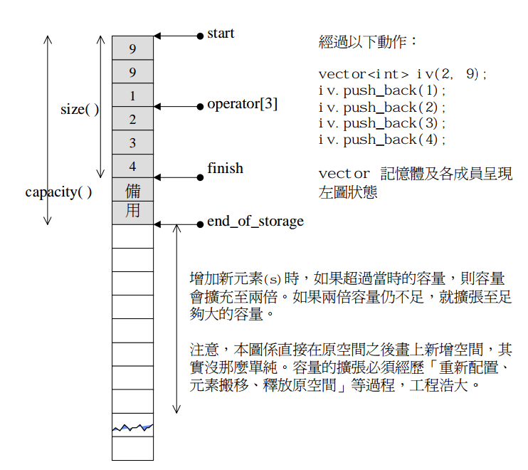
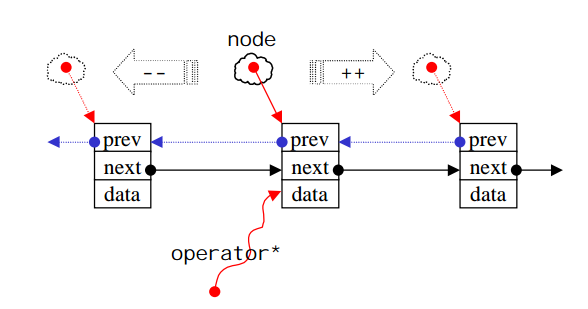
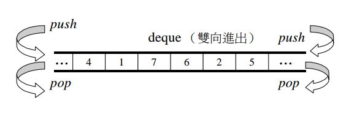

# 搞定技术面试：那些你可能不知道的 vector 和 array 的区别

最近几年，计算机工作越发难找，你必须比其他人了解的更多，才能有更多的机会找到一个更好的工作。

C++ 标准库（STL）是很多C++面试中都会问到的问题，很多很多问题会关于 Vector 的空间分配、动态增长之类的问题，那么你了解 STL 中那些顺序容器的区别与联系吗？
你知道在什么情况选用什么容器吗？

先说结论，一般情况选择 `vector` 是很好的选择，如果你的程序目标有如下特点时，才可能需要换用别的容器：
- 有很多小元素、空间额外开销比较重要，不要使用 list 和 forward_list；
- 程序要求随机访问，选择 vector 和 deque；
- 程序经常在中间插入元素，可以选择 list 和 forward_list；
- 程序只在头尾插入元素，不常在中间插入元素，选择 deque；
- 程序一开始插入时会在中间插入元素，但之后的使用过程中基本不在中间插入元素，先用 list 处理输入场景，再用 vector 拷贝 list 的数据，处理后续使用。

# 整体介绍
**所有的顺序容器都具有可以快速按顺序访问元素的能力**，但每种容器在具体的实现上又有些区别。

| 顺序容器类型 | 含义 | 特点 |
| - | - | - |
| vector | 可变大小数组 | 随机访问快、尾部插入元素快、其他位置插入、删除元素慢 |
| deque | 双端队列 | 随机访问快、头尾插入元素快 |
| list | 双向链表 | 只支持双向顺序访问、在任何位置插入、删除元素都很快 |
| forward_list | 单向链表 | 只支持从前往后的单向顺序访问、在任何位置插入删除元素都很快 |
| array | 固定大小数组 | 随机访问快、容器大小固定不支持插入删除元素 |
| string | 字符串，类似vector，专门保存字符、随机访问快、在尾部插入删除元素快 |

# 按类型介绍
## vector string

vector 和 string 将元素保存在连续的内存空间中，分配一段连续的内存空间进行存储，**其迭代器采用 C++ 指针即可**，因此其支持随机访问和存储，支持下标操作符，节省空间。但是其在分配的内存不够的情况下，需要对容器整体进行重新分配、拷贝和释放等操作（空间的动态增长），而且在 vector 和 string 中间插入或删除元素效率很低。

vector的内存分配实现原理：STL内部实现时，首先分配一个非常大的内存空间预备进行存储，即capacity（）函数返回的大小，当超过此分配的空间时再整体重新放分配一块内存存储（VS6.0是两倍，VS2005是1.5倍），所以这给人以vector可以不指定vector即一个连续内存的大小的感觉。通常此默认的内存分配能完成大部分情况下的存储。
    
扩充空间（不论多大）都应该这样做：
1. 配置一块新空间
2. 将旧元素一一搬往新址
3. 把原来的空间释放还给系统

## list forward_list
list 和 forward_list 是以节点形式来存放数据，使用的是非连续的内存空间来存放数据，因此，在其内部插入和删除元素的时间复杂度都是O(1),但是其不支持随机访问和存取，不支持下标；因为每个结点需要额外空间存储连接的情况，他们比 vector 占用的内存要多很多。

list 是非连续存储结构，具有双链表结构，每个元素维护一对前向和后向指针，因此支持前向/后向遍历。支持高效的随机插入/删除操作，但随机访问效率低下，且由于需要额外维护指针，开销也比较大。每一个结点都包括一个信息快Info、一个前驱指针Pre、一个后驱指针Post。可以不分配必须的内存大小方便的进行添加和删除操作。使用的是非连续的内存空间进行存储。

forward_list 底层实现上是单链表，且实质上无任何多余开销，与 list 相比，此容器在不需要双向迭代时提供更有效地利用空间的存储。在链表内或跨数个链表添加、移除和移动元素，不会非法化当前指代链表中其他元素的迭代器。forward_list 的迭代器不支持`iter--`操作，即不支持反向迭代；同时 forward_list 也不支持`size()`操作。

## deque
vector是一个单向开口的容器，deque则是一个双向开口的容器，所谓双向开口就是再头尾两端均可以做元素的插入和删除操作。

deque 在空间增长上与 vector 不同，它是动态的以分段的连续空间组合而成，随时可以增加一段空间连接起来。
因此，为了管理多段连接，deque有中控器的概念，此处实现上详细情况的请参见[《STL源码剖析》](https://item.jd.com/11821611.html)

## array
array 与内置数组类似，大小是固定的，因此不支持增加元素、删除元素以及改变容器大小的功能。
在使用 array 时，必须同时指定元素类型和大小`array<int,20>`

此容器是一个聚合类型，其语义等同于保有一个 C 风格数组 T[N] 作为其唯一非静态数据成员的结构体。该结构体结合了 C 风格数组的性能、可访问性与容器的优点，比如可获取大小、支持赋值、随机访问迭代器等。

# 迭代器 Iterator
迭代器的范围都是左开右闭，理解为数学上的区间则是 `[xx.begin(), xx.end())`，左边是可以达到的，右边是达不到的。

# Reference
1. [C++ Primer 5th](https://item.jd.com/11306138.html)
2. [STL 源码剖析](https://item.jd.com/11821611.html)
3. [Cppreference](https://zh.cppreference.com/w/cpp/container/forward_list)
4. [CSDN:C++三种容器：list、vector和deque的区别](https://blog.csdn.net/gogokongyin/article/details/51178378)