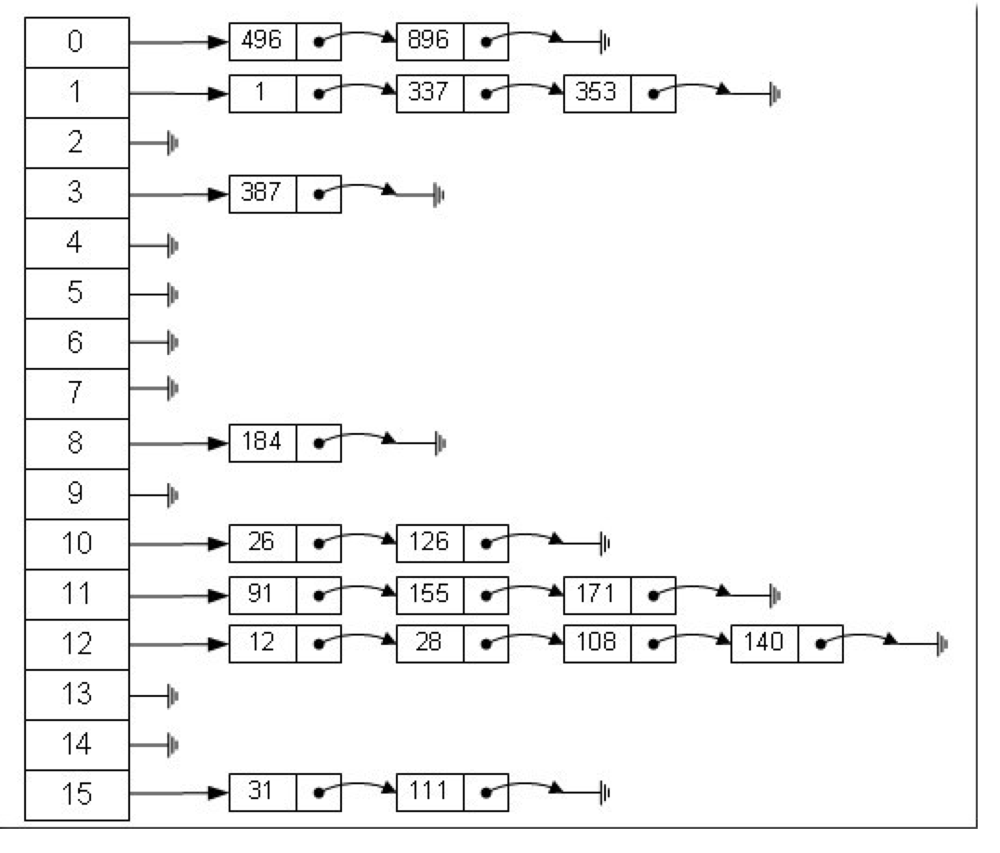

# 哈希表
哈希表的时间复杂度最差是O(n),平均时间复杂度O(1)。

## 散列表

本节围绕以下内容展开：  

* 散列表
* 散列函数设计
* 冲突处理
* hashmap数据结构


散列表使用某种算法操作(散列函数)将键转化为数组的索引来访问数组中的数据，这样可以通过Key-value的方式来访问数据，达到常数级别的存取效率。现在的nosql数据库都是采用key-value的方式来访问存储数据。

散列表是算法在时间和空间上做出权衡的经典例子。通过一个散列函数，将键值key映射到记录的访问地址，达到快速查找的目的。如果没有内存限制，我们可以直接将键作为数组的索引，所有的操作操作只需要一次访问内存就可以完成。但这种情况不太现实。


### 散列函数

散列函数就是将键转化为数组索引的过程。且这个函数应该易于计算且能够均与分布所有的键。

散列函数最常用的方法是`除留余数法`。这时候被除数应该选用`素数`，这样才能保证键值的均匀散步。

散列函数和键的类型有关，每种数据类型都需要相应的散列函数；比如键的类型是整数，那我们可以直接使用`除留余数法`；这里特别说明下，大多数情况下，键的类型都是字符串，这个时候我们任然可以使用`除留余数法`，将字符串当做一个特别大的整数。

```
int hash = 0;
for (int i=0;i<s.length();i++){
	hash = (R*hash +s.charAt(i)%M);
}
```

还有，比如下面的：

```
Hash hashCode(char *key){
	int offset = 5;
	Hash hashCode = 0;
	while(*key){
		hashCode = (hashCode << offset) + *key++;
	}
	return hashCode;		
}
```

使用时 `hashCode(key) & (size-1) ` 就可以得到一个 `size-1` 范围内的hash值


当然，还有其他的散列函数，如`平方取中法`, `随机数法`等。


### 碰撞解决

不同的关键字得到同一个散列地址` f(key1)=f(key2) `，即为碰撞 。这是我们需要尽量避免的情况。常见的处理方法有：

1. 拉链法
2. 开放地址法


#### 拉链法

将大小为M的数组中的每个元素指向一条链表，链表中的每个节点都存储了散列值为该元素索引的键值对。每条链表的平均长度是N/M，N是键值对的总个数。如下图：



添加操作： 

1. 通过hash函数得到hashCode  
2. 通过hashcode得到index  
3. 如果index处没有链表，建立好新结点，作为新链表的首结点  
4. 如果index处已经有链表，先要遍历看key是否已经存在，如果存在直接返回，如果不存在，加入链表头部  


删除操作： 

1. 通过hash函数得到hashCode  
2. 通过hashcode得到index  
3. 遍历链表，删除结点  


#### 开放地址法

使用大小为M的数组保存N个键值对，当碰撞发生时，直接检查散列表中的下一个位置。
检查的方法可以是`线性检测、平方检测、双哈希`等方法，主要区别在于检测的下一个位置。
《算法导论》中更推荐双哈希方法。

```
// 插入算法
HASH-INSERT(T, k)
    i = 0
    repeat
        j = h(k, i)
        if T[j] == NIL
            T[j] = k
            return j
        else
            i++
    until i == m
    error "hash table overflow"

// 搜索算法
HASH-SEARCH(T, k)
    i = 0
    repeat
        j = j(k, i)
        if T[j] == k
            return j
        i++
    until T[j] == NIL or i == m
    return NIL
```

### Hashmap应用

1.  cocos2d 游戏引擎  CCScheduler  
2.  linux 内核bcache。 缓存加速技术，使用SSD固态硬盘作为高速缓存，提高慢速存储设备HDD机械硬盘的性能
3. hash表在海量数据处理中有广泛应用。如海量日志中，提取出某日访问百度次数最多的IP


# references
1. [Algotithm 3rd]()