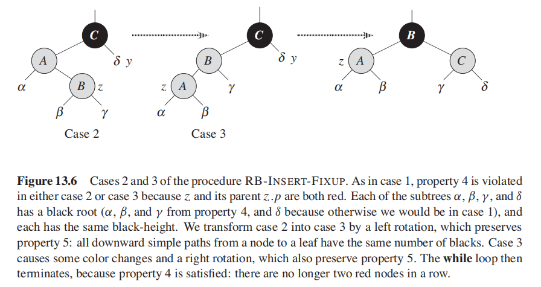

# 红黑树
红黑树是平衡的查找树的一种，最坏的基本操作的时间复杂度是 O(lgn)。

红黑树是一棵二叉搜索树，每个结点增加了一个颜色属性，可以标识为红色或黑色，通过对任意一条从根结点到叶子结点的路径上的颜色做约束，保证没有任意一条路径比其他的路径长出2倍，因此近乎是平衡的。

红黑树的每个结点包含5个属性：`color, key, left, right, parent`。

**红黑树属性**
1. 每个结点必须是红色或者黑色中的一种颜色；
2. 根结点的颜色是黑色的；
3. 每个叶子结点是黑色的（NIL结点）；
4. 如果一个结点是红色的，则它的两个子节点都是黑色的；
5. 对每个结点，从该结点到其所有的后代叶结点的简单路径上，均包含相同数目的黑色结点；

**黑高**：从某个结点x出发到叶子结点的任意一条简单路径的所经过的黑色结点的个数；
**高度**：一棵有n个内部结点的红黑树的高度至多是`2lg(n+1)`

## 算法
```
// 旋转，左旋与右旋对称
LEFT-ROTATE(T, x)
    y = x.right         // set y
    x.right = y.left    // turn y's left subtree into x's right subtree
    if y.left != T.nil
        y.left.p = x
    y.p = x.p           // link x's parent to y
    if x.p == T.nil
        T.root = y
    elseif x == x.p.left
        x.p.left = y
    else
        x.p.right = y
    y.left = x          // put x on y's left
    x.p = y
```


### 插入
```
RB-INSERT(T, z)
    y = T.nil
    x = T.root
    while x != T.nil
        y = x
        if z.key < x.key
            x = x.left
        else
            x = x.right
    z.p = y
    if y == T.nil
        T.root = z
    elseif z.key < y.key
        y.left = z
    else 
        y.right = z
    z.left = T.nil
    z.right = T.nil
    z.color = RED
    RB-INSERT-FIXUP(T,z)
// 红黑树的插入与二叉搜索书的插入有四处不同
// 1. 将 nil 更改为哨兵方式，使用 T.nil替代
// 2. 置 z.left 和 z.right 为 T.nil ，保持合理的树结构
// 3. 将 z 初始化为红色
// 4. 因为将 z 置为红色时可能违反属性2 和属性4，所以使用 Fixup 函数保持红黑树的性质。

RB-INSERT-FIXUP(T, z)
    while z.p.color == RED
        if z.p == z.p.p.left
            y = z.p.p.right
            if y.color == RED
                z.p.color = BLACK       // case 1
                y.color = BLACK         // case 1
                z.p.p.color = RED       // case 1
                z = z.p.p               // case 1
            else
                if z == z.p.right       // case 2
                    z = z.p             // case 2
                    LEFT-ROTATE(T, z)   // case 2
                z.p.color = BLACK       // case 3
                z.p.p.color = RED       // case 3
                RIGHT-ROTATE(T, z.p.p)  // case 3
        else
            // 与上方对称，将 left 与 right 颠倒一下
    T.root.color = BLACK

// Case 1: y 的父节点的兄弟结点是红色 （z是红色，z的父亲结点和父亲的兄弟节点都是红色）
// Case 2: z 的父亲的兄弟结点是黑色，且 z 是一个右孩子 (z是红色，z的父亲结点是红色，但父亲结点的兄弟节点是黑色) 
//           - 需要转换为 Case 3 然后在进行处理
// Case 3: z 的父亲的兄弟结点是黑色的，且z是一个左孩子
```

Case 1:


Case 2 and Case 3:


### 删除
删除一个结点需要时间复杂度O(lgn)，删除结点的操作相对复杂些。

```
RB-TRANSPLANT(T, u, v)
    if u.p == T.nil
        T.root = v
    elseif u == u.p.left
        u.p.left = v
    else 
        u.p.right = v
    v.p = u.p

// 与二叉搜索树的删除相比，多了几行代码记录y的踪迹，因为y有可能导致红黑树的性质被破坏
// 当想要删除结点z，如果z的子节点少于2个时，z从树中删除，并让y成为z。
// 当z有两个子节点时，y应该是z的后序，并且y将移动到z的位置，
// 在结点被移动之前，需要记住y的颜色，并记录结点 x 的总计，将x移动至树中y的原来位置，
// 因为结点x也可能引起红黑树的属性的破坏，删除结点 z 之后，红黑树调用了FIXUP来恢复红黑性质
// 如果y是黑色的，则删除和移动y可能会导致红黑树的属性发生破坏，
// 当y是红色时，(删除后黑高不变，并不破坏红黑树性质;不存在相邻的红色结点)

RB-DELETE(T, z)
    y = z
    y-original-color = y.color
    if z.left == T.nil
        x = z.right
        RB-TRANSPLANT(T, z, z.right)
    elseif z.right == T.nil
        x = z.left
        RB-TRANSPLANT(z, z, z.left)
    else
        y = TREE-MINIMUM(T, y, y.right)
        y-original-color = y.color
        x = y.right
        if y.p == z
            x.p = y
        else
            RB-TRANSPLANT(T, y, y.right)
            y.right = z.right
            y.right.p = y
        RB-TRANSPLANT(T, z, y)
        y.left = z.left
        y.left.p = y
        y.color = z.color
    if y-original-color == BLACK
        RB-DELETE-FIXUP(T, x)

RB-DELETE-FIXUP(T, x)
    while x != T.root and x.color == BLACK
        if x == x.p.right
            w = x.p.left
            if w.color == RED
                w.color = BLACK          // case 1
                x.p.color = RED          // case 1
                LEFT-ROTATE(T, x.p)      // case 1
                w = x.p.right            // case 1
            if w.left.color == BLACK and w.right.color == BLACK
                w.color = RED            // case 2
                x = x.p                  // case 2
            else 
                if w.right.color == BLACK
                    w.left.color = BLACK // case 3
                    w.color = RED        // case 3
                    RIGHT-ROTATE(T, w)   // case 3
                    w = x.p.right        // case 3
                w.color = x.p.color      // case 4
                x.p.color = BLACK        // case 4
                w.right.color = BLACK    // case 4
                LEFT-ROTATE(T, x.p)      // case 4
                x = T.root               // case 4
        else
            // 对称， 交换 left 和right
    x.color = BLACK
 
```
如果 y 是黑色，会产生三个问题：
1. y是原来的根节点，y的一个红色孩子成为了根节点，违反了性质2；
2. x和x.p是红色的，违反了性质4；
3. 在树中移动了y结点，导致一条路径上的黑色结点少一，违反了性质5；（将任意包含x的简单路径上黑色结点数量增加1）


- Case 1: x 的兄弟结点 w 是红色的；（转换成Case 2 || 3 || 4 处理）
- Case 2: x 的兄弟结点 w 是黑色的，而且 w 的两个子结点都是黑色的；
- Case 3: x 的兄弟结点 w 是黑色的，w的左孩子是红色的，w的右孩子是黑色的；（将 Case 3 转换成 Case 4）
- Case 4: x 的兄弟结点 w 是黑色的，且 w 的右孩子是红色的；


**五个性质**
1. 节点是红色或黑色。
2. 根是黑色。
3. 所有叶子都是黑色（叶子是NIL节点）。
4. 每个红色节点必须有两个黑色的子节点。（从每个叶子到根的所有路径上不能有两个连续的红色节点。）
5. 从任一节点到其每个叶子的所有简单路径都包含相同数目的黑色节点。

**红黑树和AVL树相比呢，优势在哪里？**

A：两者都是特殊的BST，相比AVL，红黑树不要求严格的1的高度差，对于插入操作，两个树类似，最多旋转两次，对于删除，红黑树最多旋转3次，而AVL树则是O（logN）

**那红黑树的高度差最多？**

A:最长路径和最短路径最多相差一倍。